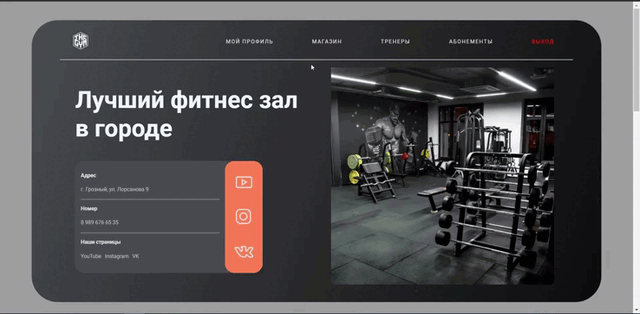
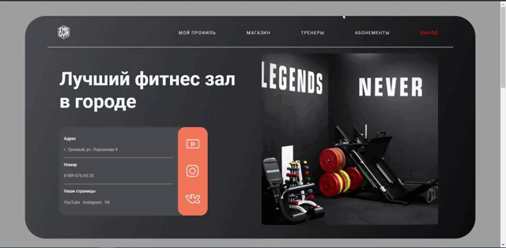

<h1 align="center"> TheGym </h1>

[Демонстрация](https://my-project-gym.herokuapp.com/)

**«TheGym»** - это web-приложение для фитнес зала. Позволящее пользователям в онлайн режиме покупать абонемент в зал, выбирать тренера для тренировок, а также покупать спортивное питание прямо в строенном магазине.

<p align="center">
  
</p>


##  Функционал пользователя приложения:

- Регистрация/Авторизация
- Покупка абонемента
- Выбор тренера для тренировок
- Просмотр своего профиля
- Просмотр остаточного времени абонемента в профиле
- Просмотр выбранного тренера в профиле
- Покупка спортивного питания
- Просмотр и изменение выбранного спортивного питания в корзине

<p align="center">
  
</p>

<p align="center">
  
</p>


##  Функционал админа приложения:

- Добавление, удаление из базы данных:
  * абонемента
  * тренера
  * спортивного питания
- Просмотр пользователей, купивших абонемент

<p align="center">
  
</p>


## Мои задачи: 

- [x] Создание react приложения
- [x] Создание и контроль веток git
- [x] Создание модели и контроллера абонемента на сервере
- [x] Создание модели и контроллера спортпита на сервере
- [x] Создание контроллера для корзины спортпита на сервере
- [x] Создание встроенного магазина на клиенте
- [x] Исправление ошибок, возникающих в процессе разработки

<p align="center">
  
</p>


## Для решения поставленных задач, использовал:

- Node.js, express, multer, MongoDB, prettier - на сервере
- React, react-router-dom, react-hooks, redux, redux-thunk, redux-logger - на клиенте

---

## Команда проекта


<h3>
  <a href="https://github.com/Bilal-1309">
    
  </a>
</h3>

<h3>
  <a href="https://github.com/Amirhad">
    
  </a>
</h3>

<h3>
  <a href="https://github.com/AdamMutaev">
    
  </a>
</h3>

<h3>
  <a href="https://github.com/Iznaur18">
    
  </a>
</h3>

<h3>
  <a href="https://github.com/Viskh">
    
  </a>
</h3>

---


## Запуск проекта

Для запуска проекта вам необходимо набрать команду в терминале:

```javascript
npm i
```

После набрать команду:

```javascript
npm run dev
```


